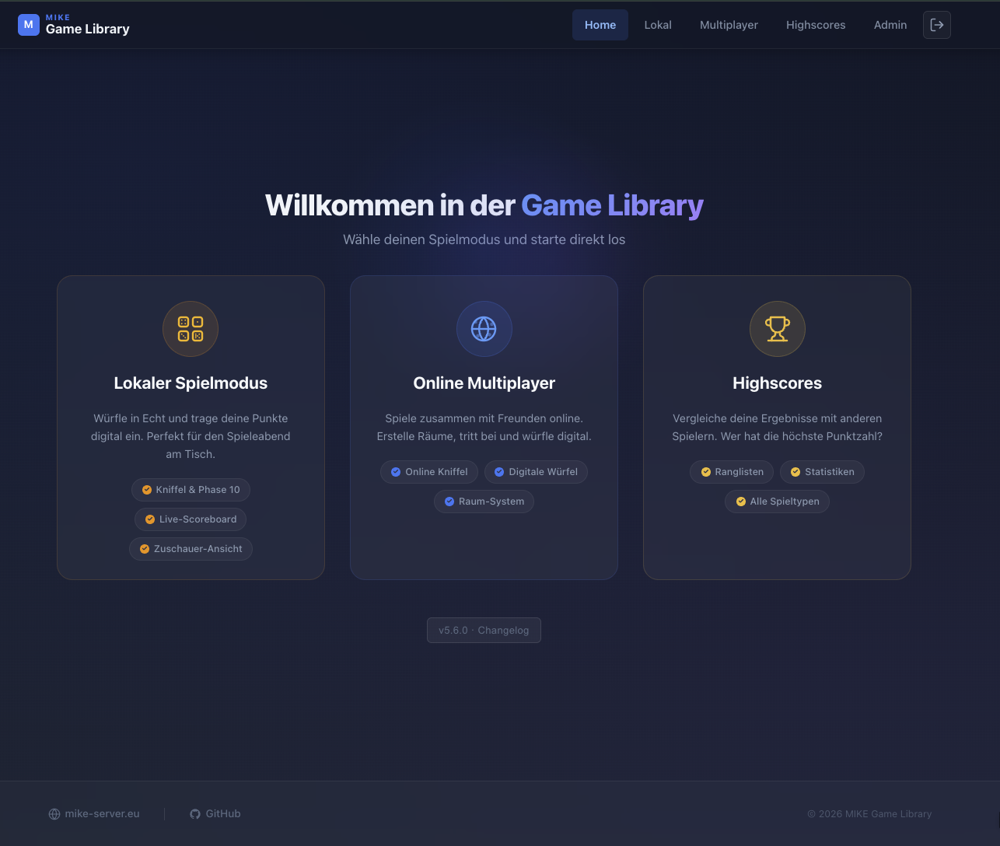

# MIKE - Game Library

Webbasierte Spielebibliothek mit Online-Multiplayer.

<p align="center">
  
</p>

## Tech-Stack

| Bereich | Technologie |
|---|---|
| Backend | Node.js 20, Express, Sequelize |
| Frontend | React 19, Vite 6 |
| Datenbank | MariaDB |
| Echtzeit | Socket.IO |
| Webserver | Nginx (Reverse-Proxy) |
| SSL | Let's Encrypt (optional) |
| DB-Verwaltung | phpMyAdmin (Auto-Login) |

## Mindestanforderungen Server

| Ressource | Minimum |
|---|---|
| Betriebssystem | Debian 12 |
| RAM | 1 GB |
| vCPU | 1 |
| Disk | 5 GB |
| Ports | 80 (HTTP), 443 (HTTPS/optional) |

## Plesk Git kompatibel

Nein. Eigener Nginx + Systemd-Service, ausgelegt fuer Bare-Metal Debian 12.

## Installation

### 1. Server vorbereiten

Frischer Debian 12 Server mit Root-Zugang.

### 2. Installer ausfuehren

```bash
curl -sL https://raw.githubusercontent.com/michaelnid/GameLibrary/main/setup.sh | sudo bash
```

Der Installer richtet automatisch ein:
- Node.js 20, MariaDB, Nginx, PHP-FPM, phpMyAdmin
- Systemd-Service (`game-library`)
- SSL via Let's Encrypt (optional, bei Domain-Angabe)
- Auto-Updater mit One-Click Updates aus dem Admin-Panel
- phpMyAdmin mit Auto-Login aus dem Admin-Panel

### 3. Zugangsdaten abrufen

```bash
grep '^ADMIN_DEFAULT_PASSWORD=' /opt/game-library/.env
```

### 4. Anmelden

Im Browser die Server-IP oder Domain oeffnen und mit `admin` + dem Passwort aus Schritt 3 einloggen.

### 5. Updates

Updates werden im Admin-Panel unter "Updates" angezeigt und mit einem Klick installiert.

Manuelles Update per SSH:

```bash
sudo /usr/local/bin/game-library-updater
```

## Hilfsbefehle

```bash
# Service Status
systemctl status game-library

# Service Neustart
systemctl restart game-library

# Logs anzeigen
journalctl -u game-library -f

# phpMyAdmin-Zugang anzeigen
grep '^PHPMYADMIN_' /opt/game-library/.env
```

## Lizenz

Privates Projekt. Alle Rechte vorbehalten.
